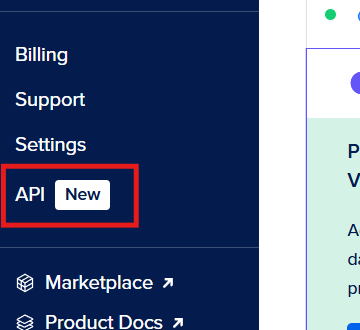
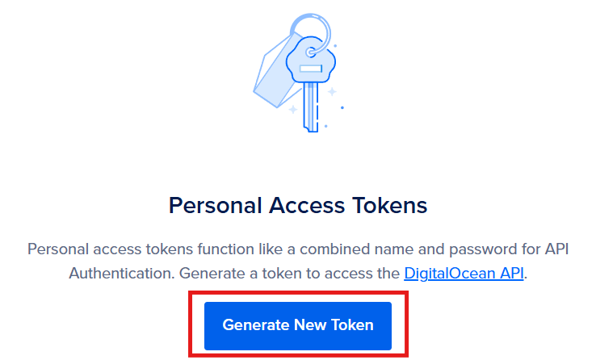
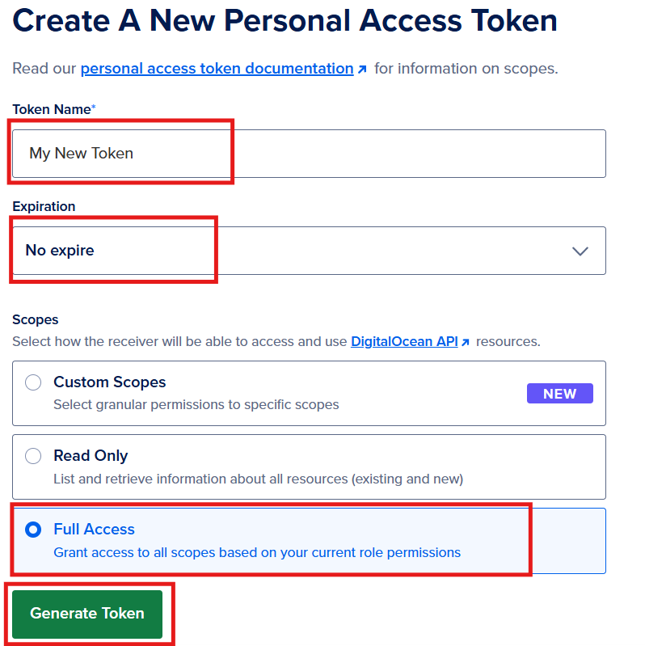
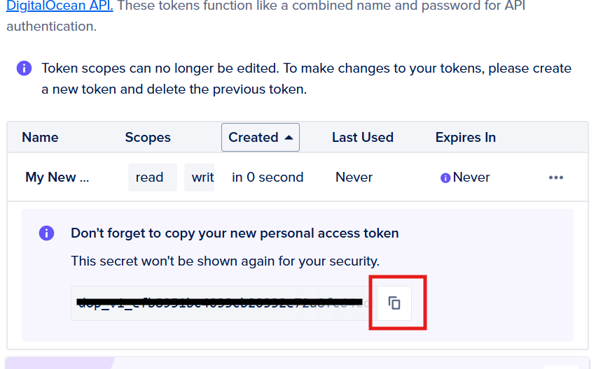

# Setting Up an Arch Linux Droplet on DigitalOcean using `doctl`

### Intro
#### This instruction will guide you to:
1. Install `doctl`
2. Create an API token
3. Use the API token to authenticate `doctl`
4. Generate SSH keys
5. connect SSH keys to DigitalOcean
6. Create a `.yaml` 
7. Create a droplet
8. Connect the droplet to `config` 

#### Prerequisites
- DigitalOcean account
- Droplet environment with Arch Linux 
---
### Install `doctl`
`doctl` is a Command-Line Interface (CLI) tool on DigitalOcean. It allows you to interact with DigitalOcean's API from the command line, making it easier to automate tasks, and manage resources. 

> **Note**: You will use the Droplet Arch Linux that you have created.

**1. Open Terminal**

**2. Access your Arch Linux**
Type and run commands below. 
```bash
ssh arch
```
- Make sure to change `arch` to **your actual Arch Linux name.**
**3. Install** `wget`
Type and run commands below. 
```bash
sudo pacman -Sy wget
```
- `sudo`: Command that allows you to run a command as the root user(super user).
- `pacman`: Command that manage software packages for Arch Linux.
- `-Sy`: Synchronize packages up to the latest versions.

	You will see:
	`:: Proceed with installation? [Y/n]`
	Type `y` and press **Enter**

**4**. **Download the most recent version of** `doctl`

> **Note**: You can check the latest version here: [Release Notes](https://docs.digitalocean.com/release-notes/doctl/) 

Type and run commands below. 
```bash
cd ~
wget https://github.com/digitalocean/doctl/releases/download/v1.110.0/doctl-1.110.0-linux-amd64.tar.gz
```
- This link is up to date as of 2024.09.27

**5. Extract the binary**
Type and run commands below. 
```bash
tar xf ~/doctl-1.110.0-linux-amd64.tar.gz
```
- `tar`: Command that make and extract archive.
- `x`: Command that extract archive.
- `f`: Command that chooses file path and name.

**6. Move the** `doctl` **binary into the path**
Type and run commands below. 
```bash
sudo mv ~/doctl /usr/local/bin
```

> [!note] Why do I need to move it?
> So that the system can find and run the `doctl` command from anywhere.
> This is the same action of modifying System variables in Windows OS.

Now you have successfully installed `doctl`.

---
### Create an API token
An API token is an essential security key that you to access DigitalOcean's API. It allows the `doctl` to interact with DigitalOcean programmatically.

**1. Log in to the DigitalOcean control panel**
Click here: [DigitalOcean Control Panel](https://cloud.digitalocean.com/).

**1. Click API in the left menu**



**3. Click Generate New Token in the middle of Personal Access Tokens area**


**4. Fill out Token Name and choose options, then Click generate Token

- **Token Name**: Name your token
- **Expiration**: You can choose depends on usage, the shorter expiry date is considered the more secure in general, but requires frequent renewal.
- **Scopes**: Since this token is for your own project purpose, choose Full access. Read Only access is recommended when modification should be prevented.

**5. Find the token and Click copy**


>[!Important!] 
>The token is only shown once. If you lose it, you need to create a new one.

**6. Save your token**
Open Arch Linux and then type and run commands below. 
```bash
echo "your_token_code" > ~/.ssh/my_token_name.txt
```
- This command write your copied token into a `txt` file in the folder `.ssh` so that you can save your token information.
- Make sure to change `"your_token_code"` to **your actual code that you copied,** as well as change the `my_token_name` to the **filename** you want to use.

Now you have successfully created and saved an API Token.

---

### Use the API token to authenticate `doctl`
By authenticating `doctl` with your API token, you will be allowed to work on your DigitalOcean account through `doctl`.

> [!Note] Get ready for your API token
> You will be required to type the API token that you just created.
> Copying it into clipboard before you start this steps. That will make steps easier

**1. Initiate authentication**
Open Arch Linux and then type and run commands below.
```bash
doctl auth init --context my_project
```
- Make sure to change `"my_project"` to **your actual project name**.

**2. Type your API token**
Then you will see:
`Enter your access token:    ✱ required`
Type your API token, then Press **Enter**

>[!Error Handling]
>It might show you an error:
>`Error: Unable to initialize DigitalOcean API client: access token is required. (hint: run 'doctl auth init')`
>If so:
>Run `doctl auth init` and follow step 2 again.

**3.Validate** `doctl`
You can check your account details.
Type and run commands below.
```bash
doctl account get
```

If successful, you will see the output like:
```bash
Email              Droplet Limit    Email Verified    UUID              Status
sammy@example.org  10               true              3a56c5e109737c    active
```
- `Email`: The identity of the account
- `Droplet Limit`: The limits of your droplets on your account
- `Email Verified`: Your account has been verified
- `UUID`: The unique identifier used for internal operations in DigitalOcean
- `Status`: The status of your account

Now you have successfully authenticated `doctl` with your API Token.

---
### Generate SSH keys 
SSH keys work as a pair which one is public, another is private. Because of that feature, this provides stronger security than passwords methods. 

> [!note] On Arch Linux, `ssh-keygen` is typically included with the OpenSSH package. 
>
> **Check if `ssh-keygen` is installed**
>```bash
ssh-keygen -v
>```
**If it's not installed, install it using `pacman`**
>```bash
sudo pacman -S openssh

**1. Create a new SSH key pair**
Open Arch Linux and then type and run commands below.
```bash
ssh-keygen -t ed25519 -f ~/.ssh/Mykey -C "your_email"
```
- `-t ed25519`: Type of encryption (ed25519).
- `-f ~/.ssh/your_key`: Filename and location to save the key.
- `-C "your email address"`: Adds a comment to the key.
- Make sure to change `"your_key"` to **the key name that you want to use**.
- Make sure to change `"your_email"` to **comments that can identify the key**.

> [!note] Should I create passphrase?
> **You will be asked to:**
> `Enter passphrase (empty for no passphrase):`
> `Enter same passphrase again:`
> 
> You may want to skip setting a passphrase for convenience if:
> - You are the only one who has access to your computer environment
>
**To skip**: Press **Enter** twice.
> 
> Consider setting a passphrase if:
> - You want an extra layer of security
> - You share your computer environment with others
>
>**To Create your own passphrase**: Type a passphrase when prompted and then re-type it to confirm.

**2. Check SSH Keys**
Type and run commands below.
```bash
ls ~/.ssh
```
You will see:
	`your_key`: Your private key
	`your_key.pub`: Your public key

Now you have successfully created your SSH Keys. 

---
### Connect SSH keys to DigitalOcean
By connecting SSH keys to DigitalOcean, you will be safely connected to the DigitalOcean including your droplets. 

**1. Connect SSH key to DigitalOcean**
Open Arch Linux and then type and run commands below.
```bash
doctl compute ssh-key import your_key --public-key-file ~/.ssh/do-key.pub
```
- `compute`: Command that working with droplets
- `ssh-key import`: Command that importing an SSH key.
- `your_key`: This is the name of SSH key you give within DigitalOcean. 
- `--public-key-file ~/.ssh/your_key.pub`: get public key from the path.

**2. Check SSH Keys are connecting**
Type and run commands below.
```bash
doctl compute ssh-key list
```
- This command will list ssh-keys that are connected.

You will see like:
```bash
ID          Name        FingerPrint
43506344    your_key    db:7c:d0:4b:dc:6c:24:ac:2b:5d:c6:9e:d7:bc:d8:18
```

Now you have successfully connected your SSH keys to DigitalOcean.

---
### Create a `.yaml`

**1. Create yaml file**
Type below.
```bash
nvim ~/.ssh/filename.yaml
```

**2. Type content inside of yaml file**
Type below.
```yaml
users:
  - name: user-name #change me
    primary_group: group-name #change me
    groups: wheel
    shell: /bin/bash
    sudo: ['ALL=(ALL) NOPASSWD:ALL']
    ssh-authorized-keys:
      - ssh-ed25519 ...
packages:
  - ripgrep
  - rsync
  - neovim
  - fd
  - less
  - man-db
  - bash-completion
  - tmux
disable_root: true
```
**`users`**: This section defines user accounts to be created on the instance.

- **`- name: user-name #change me`**: Replace `user-name` with the desired username for the new user account. This account will be created during the initialization process.
    
- **`primary_group: group-name #change me`**: Replace `group-name` with the primary group that the user will belong to. This is often the same as the username (e.g., `user-name`).
    
- **`groups: wheel`**: This adds the user to the `wheel` group, which typically has administrative privileges on many Linux distributions.
    
- **`shell: /bin/bash`**: Specifies the default shell for the user. In this case, it sets the shell to Bash.
    
- **`sudo: ['ALL=(ALL) NOPASSWD:ALL']`**: This line allows the user to run any command with `sudo` without being prompted for a password. This can be convenient for automation but may pose a security risk if not managed carefully.
    
- **`ssh-authorized-keys`**: This specifies the SSH public keys that will be authorized for the user. The key should be replaced with the actual public key (e.g., `ssh-ed25519 AAAAC...`).
- **`packages`**: This section lists software packages that will be installed on the instance during initialization.

- **`ripgrep`**: A fast search tool.
- **`rsync`**: A utility for efficiently transferring and synchronizing files.
- **`neovim`**: A text editor based on Vim, improved with modern features.
- **`fd`**: A simple, fast, and user-friendly alternative to `find`.
- **`less`**: A terminal pager program used to view the contents of files one screen at a time.
- **`man-db`**: Provides the man command to read manual pages for commands and applications.
- **`bash-completion`**: Adds bash completion features, allowing for easier command-line navigation and usage.
- **`tmux`**: A terminal multiplexer that allows users to manage multiple terminal sessions from a single window.
- **`disable_root: true`**: This setting disables the root user account for login, enhancing security by encouraging the use of a regular user account instead. Users will typically use `sudo` to perform administrative tasks.
-
### Create a droplet
**1. Open Terminal and access Arch Linux environment**
To access Arch Linux, type command below. 
```bash
ssh arch
```

**2. Find your SSH key ID**
Type command below.
```bash
doctl compute ssh-key list
```
This will show you the result like:
```bash
ID          Name         FingerPrint
43506344    do-key       db:7c:d0:4b:dc:6c:24:ac:2b:5d:c6:9e:d7:bc:d8:18
```

**3. Find your Arch Linux image**
We will reuse the Arch Linux image that you have uploaded through DigitalOcean website for the first droplet creation.
Type command below.
```bash
doctl compute image list-user
```
This will show you the result like:
```bash
ID           Name                                                Type      Distribution    Slug    Public    Min Disk
165084665    Arch-Linux-x86_64-cloudimg-20240901.259602.qcow2    custom    Arch Linux              false     7
```

**4. Create droplet**
Type below.
```bash
doctl compute droplet create --image 165084665 --region sfo3 --size s-1vcpu-1gb --ssh-keys 43506344 --user-data-file ~/.ssh/droplet_setting.yaml --wait dropletName
```
- `compute droplet create`: command to create droplet
- `dropletName`: replace this to the actual droplet name that you want to create
- `--region sfo3`: Choose region of data center in San Francisco, SFO3
- `--image 165084665`: The image of you want to use. Replace this to the actual Arch linux image ID from the step 3.
- `s`: This means a "Standard" droplet size.
- `1vcpu-1gb`:  This means 1 virtual CPU for processing tasks and 1 GB of RAM for running applications.
- `--ssh-keys 43506344`: Replace this to your actual SSH key from the step 2

you can check your droplet created well

```bash
doctl compute droplet list
```

will show you like:

```bash
ID Name Public IPv4 Private IPv4 Status 12345678 my-droplet 192.0.2.1 10.0.0.1 active
```


note how to connect to your droplet?

After you have created a droplet you can connect to it via SSH.

```
ssh -i .ssh/do-key arch@your-droplets-ip-address
```

- `-i` = identity_file, the path to the private key file
- arch = your username. The image that we used contains a regular user named "arch"

To exit your SSH connect just type `exit` and press enter.

### Connect the droplet to `config`
Now we need to connect the new droplet we created with the ssh key.
If you plan on keeping the same server for most of your class work it might be easier for you to connect to with an SSH config file. The instructions below are the same for Linux, MacOS and Windows

create a "config" file(no file extension) in the ".ssh" directory in your home directory.

create config in .ssh
```bash
nvim ~/.ssh/config
```

Assuming you followed along with all of the steps above the only thing you have to change in the example file below is the IP address. in "HostName" replace the example IP address with the IP address of your droplet. Save the file and re-start your terminal.

After you should be able to connect to your server with the command:

```
ssh arch
```

Example ssh config file:

```
Host arch
  HostName 143.198.140.15
  User arch
  PreferredAuthentications publickey
  IdentityFile ~/.ssh/do-key
  StrictHostKeyChecking no
  UserKnownHostsFile /dev/null
```


---

### Reference

- [2420-notes/week-two.md · main · cit_2420 / 2420-notes-F24 · GitLab](https://gitlab.com/cit2420/2420-notes-f24/-/blob/main/2420-notes/week-two.md) [add wk3 notes](https://gitlab.com/cit2420/2420-notes-f24/-/commit/b7dad161190c2dc42179af14dee9b0fa9705fd62)

[Nathan McNinch](https://gitlab.com/nathan-climbs) add wk3 notes September 16, 2024 at 8:16:13 PM PDT

- [pacman - ArchWiki (archlinux.org)](https://wiki.archlinux.org/title/Pacman)

- [2420-notes/week-one.md · main · cit_2420 / 2420-notes-F24 · GitLab](https://gitlab.com/cit2420/2420-notes-f24/-/blob/main/2420-notes/week-one.md) [update week2 notes](https://gitlab.com/cit2420/2420-notes-f24/-/commit/84ac437525f82eba6a0616c82fd58e2346901d9e)

- [Nathan McNinch](https://gitlab.com/nathan-climbs) authored September 10, 2024 at 6:47:02

[2420-notes/week-three.md · main · cit_2420 / 2420-notes-F24 · GitLab](https://gitlab.com/cit2420/2420-notes-f24/-/blob/main/2420-notes/week-three.md) - [**week-three.md**](https://gitlab.com/cit2420/2420-notes-f24/-/blob/main/2420-notes/week-three.md)

- [How to Get Started With Doctl, DigitalOcean's Command-Line Client (howtogeek.com)](https://www.howtogeek.com/devops/how-to-get-started-with-doctl-digitaloceans-command-line-client/)

By [James Walker](https://www.howtogeek.com/author/jameswalker/)

Published Feb 8, 2021


[doctl Command Line Interface (CLI) | DigitalOcean Documentation](https://docs.digitalocean.com/reference/doctl/)

[Paperspace APIs, CLIs, and SDKs Overview | DigitalOcean Documentation](https://docs.digitalocean.com/reference/paperspace/)

[Command Line Interface (CLI) Reference for doctl | DigitalOcean Documentation](https://docs.digitalocean.com/reference/doctl/reference/)

[DigitalOcean API Overview | DigitalOcean Documentation](https://docs.digitalocean.com/reference/api/)

[DigitalOcean Libraries | DigitalOcean Documentation](https://docs.digitalocean.com/reference/libraries/)

[How to Create a Personal Access Token | DigitalOcean Documentation](https://docs.digitalocean.com/reference/api/create-personal-access-token/)

[DigitalOcean](https://cloud.digitalocean.com/account/api/tokens?i=d1d56e)

[Command Line Interface (CLI) Reference for doctl | DigitalOcean Documentation](https://docs.digitalocean.com/reference/doctl/reference/)

[doctl auth | DigitalOcean Documentation](https://docs.digitalocean.com/reference/doctl/reference/auth/)

[doctl auth init | DigitalOcean Documentation](https://docs.digitalocean.com/reference/doctl/reference/auth/init/)

[doctl compute | DigitalOcean Documentation](https://docs.digitalocean.com/reference/doctl/reference/compute/)

[doctl compute droplet | DigitalOcean Documentation](https://docs.digitalocean.com/reference/doctl/reference/compute/droplet/)

[doctl compute ssh | DigitalOcean Documentation](https://docs.digitalocean.com/reference/doctl/reference/compute/ssh/)


doctl