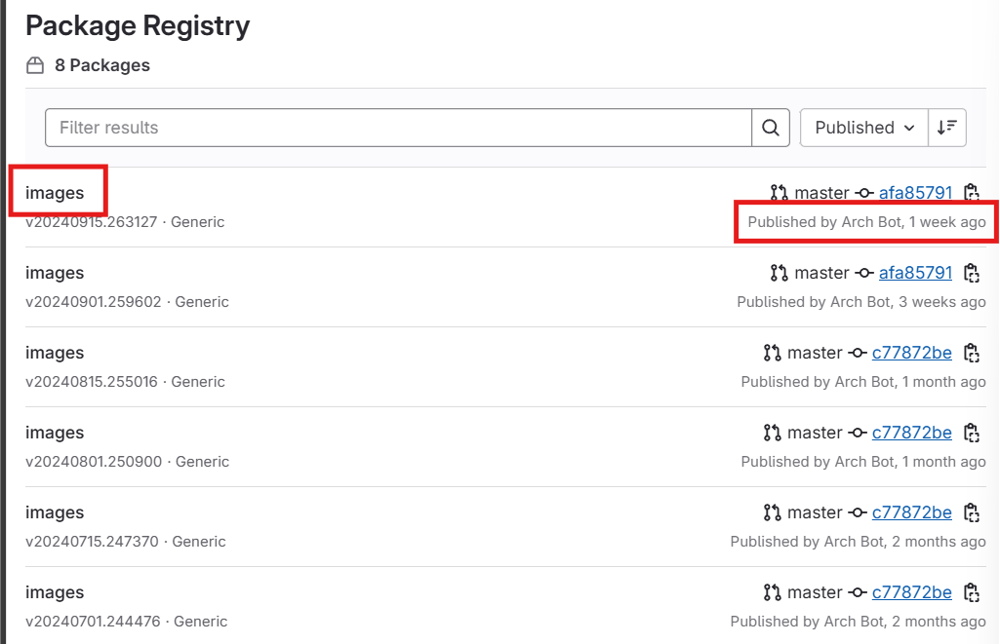
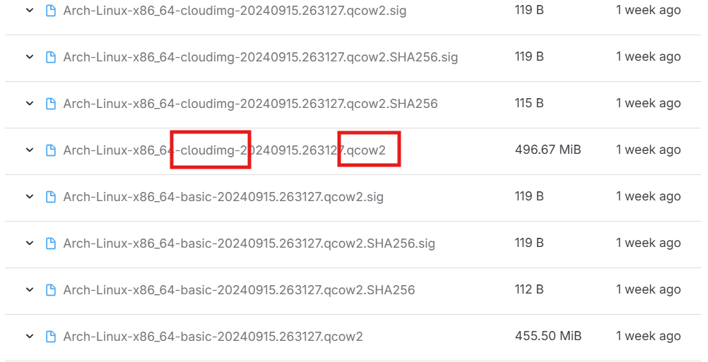

# Setting Up an Arch Linux Droplet on DigitalOcean using `doctl`

  

## Intro

### This instruction will guide you to:

1. Install `doctl`

2. Create an API token

3. Use the API token to authenticate `doctl`

4. Generate SSH keys

5. Upload a public key to DigitalOcean

6. Configure the cloud-init File

7. Upload Arch Linux image to DigitalOcean

8. Create a droplet

9. Connect the droplet to SSH `config`

  

### Prerequisites

- DigitalOcean account

- Droplet environment with Arch Linux

---

## 1. Install `doctl`

`doctl` is a Command-Line Interface (CLI) tool on DigitalOcean. It allows you to interact with DigitalOcean's API from the command line, making it easier to automate tasks, and manage resources.

  

> [!NOTE] You will use the Droplet with an Arch Linux that you have created.

  

### 1. Open Terminal

  

### 2. Access your Arch Linux

Type and run commands below.

```bash

ssh arch

```

- Make sure to change `arch` to **your actual Arch Linux name.**

  

### 3. Install `wget`

Type and run commands below.

```bash

sudo pacman -Sy wget

```

- `sudo`: Command that allows you to run a command as the root user(super user).

- `pacman`: Command that manage software packages for Arch Linux.

- `-Sy`: Synchronize packages up to the latest versions.

  

    You will see the result like:

    `:: Proceed with installation? [Y/n]`

    Type `y` and press **Enter**

  

### 4. Download the most recent version of `doctl`

  

> **Note**: You can check the latest version here: [Release Notes](https://docs.digitalocean.com/release-notes/doctl/)

  

Type and run commands below.

```bash

cd ~

wget https://github.com/digitalocean/doctl/releases/download/v1.110.0/doctl-1.110.0-linux-amd64.tar.gz

```

- This link is up to date as of 2024.09.27

  

### 5. Extract the binary

Type and run commands below.

```bash

tar xf ~/doctl-1.110.0-linux-amd64.tar.gz

```

- `tar`: Command that make and extract archive.

- `x`: Command that extract archive.

- `f`: Command that chooses file path and name.

  

### 6. Move the `doctl` binary into the path

Type and run commands below.

```bash

sudo mv ~/doctl /usr/local/bin

```

  

> [!NOTE] Why do I need to move it?

> So that the system can find and run the `doctl` command from anywhere.

>

> This is the same action of modifying System variables in Windows OS.

  

Now you have successfully installed `doctl`.

### References:

- [doctl Command Line Interface (CLI) | DigitalOcean Documentation](https://docs.digitalocean.com/reference/doctl/)

- [How to Install and Configure doctl | DigitalOcean Documentation](https://docs.digitalocean.com/reference/doctl/how-to/install/)

- [doctl Release Notes :: DigitalOcean Documentation](https://docs.digitalocean.com/release-notes/doctl/)

- [Command Line Interface (CLI) Reference for doctl | DigitalOcean Documentation](https://docs.digitalocean.com/reference/doctl/reference/)

  

---

## 2. Create an API token

An API token is an essential security key that you to access DigitalOcean's API. It allows the `doctl` to interact with DigitalOcean programmatically.

  

### 1. Log in to the DigitalOcean control panel

Click here: [DigitalOcean Control Panel](https://cloud.digitalocean.com/).

  

### 2. Click API in the left menu

  


  

### 3. Click Generate New Token in the middle of Personal Access Tokens area


  

### 4. Fill out Token Name and choose options, then Click generate Token


- **Token Name**: Name your token

- **Expiration**: You can choose depends on usage, the shorter expiry date is considered the more secure in general, but requires frequent renewal.

- **Scopes**: Since this token is for your own project purpose, choose Full access. Read Only access is recommended when modification should be prevented.

  

### 5. Find the token and Click copy


  

>[!IMPORTANT] Save your token!

>The token is only shown once. If you lose it, you need to create a new one.

  

### 6. Save your token

Open Arch Linux and then type and run commands below.

```bash

echo "your_token_code" > ~/.ssh/my_token_name.txt

```

- This command write your copied token into a `txt` file in the folder `.ssh` so that you can save your token information.

- Make sure to change `"your_token_code"` to **your actual code that you copied,** as well as change the `my_token_name` to the **filename** you want to use.

  

Now you have successfully created and saved an API Token.

  

### References:

- [How to Create a Personal Access Token | DigitalOcean Documentation](https://docs.digitalocean.com/reference/api/create-personal-access-token/)

  

---

  

## 3. Use the API token to authenticate `doctl`

By authenticating `doctl` with your API token, you will be allowed to work on your DigitalOcean account through `doctl`.

  

> [!TIP] Get ready for your API token

> You will be required to type the API token that you just created.

>

> Copying it into the clipboard before you start this steps. That will make steps easier.

  

### 1. Initiate authentication

Open Arch Linux and then type and run commands below.

```bash

doctl auth init --context my_project

```

- Make sure to change `"my_project"` to **your actual project name**.

  

### 2. Type your API token

Then you will see the result like:

  

`Enter your access token:    ✱ required`

  

Type your API token, then Press **Enter**

  

> [!NOTE] Error handling

> It might show you an error:

>

> `Error: Unable to initialize DigitalOcean API client: access token is required. (hint: run 'doctl auth init')`

>

> If so:

>

>   Run `doctl auth init` and follow step 2 again.

  

### 3.Validate `doctl`

You can check your account details.

Type and run commands below.

```bash

doctl account get

```

  

Then you will see the result like:

```bash

Email              Droplet Limit    Email Verified    UUID              Status

sammy@example.org  10               true              3a56c5e109737c    active

```

- `Email`: The identity of the account

- `Droplet Limit`: The limits of your droplets on your account

- `Email Verified`: Your account has been verified

- `UUID`: The unique identifier used for internal operations in DigitalOcean

- `Status`: The status of your account

  

Now you have successfully authenticated `doctl` with your API Token.

  

### References:

- [How to Create a Personal Access Token | DigitalOcean Documentation](https://docs.digitalocean.com/reference/api/create-personal-access-token/)

- [doctl Command Line Interface (CLI) | DigitalOcean Documentation](https://docs.digitalocean.com/reference/doctl/)

- [How to Install and Configure doctl | DigitalOcean Documentation](https://docs.digitalocean.com/reference/doctl/how-to/install/)

- [Command Line Interface (CLI) Reference for doctl | DigitalOcean Documentation](https://docs.digitalocean.com/reference/doctl/reference/)

  

---

## 4. Generate SSH keys

SSH keys work as a pair which one is public, another is private. Because of that feature, this provides stronger security than passwords methods.

> [!NOTE] On Arch Linux, `ssh-keygen` is typically included with the OpenSSH package.

  

**Check if `ssh-keygen` is installed**

```bash

ssh-keygen -v

```

**If it's not installed, install it using `pacman`**

```bash

sudo pacman -S openssh

```

  

### 1. Create a new SSH key pair

Open Arch Linux and then type and run commands below.

```bash

ssh-keygen -t ed25519 -f ~/.ssh/your_key -C "your_email"

```

- `-t ed25519`: Type of encryption (ed25519).

- `-f ~/.ssh/your_key`: Filename and location to save the key.

- `-C "your email address"`: Adds a comment to the key.

- Make sure to change `"your_key"` to **the key name that you want to use**.

- Make sure to change `"your_email"` to **comments that can identify the key**.

  

> [!NOTE] Should I create passphrase?

> **You will be asked to:**

>

> `Enter passphrase (empty for no passphrase):`

>

> `Enter same passphrase again:`

>

> You may want to skip setting a passphrase for convenience if:

> - You are the only one who has access to your computer environment

>

> **To skip**: Press **Enter** twice.

>

> Consider setting a passphrase if:

> - You want an extra layer of security

> - You share your computer environment with others

>

>**To Create your own passphrase**: Type a passphrase when prompted and then re-type it to confirm.

  

### 2. Check SSH Keys

Type and run commands below.

```bash

ls ~/.ssh

```

You will see the result like:

    `your_key`: Your private key

    `your_key.pub`: Your public key

  

Now you have successfully created your SSH Keys.

  

### References:

- [doctl compute ssh-key | DigitalOcean Documentation](https://docs.digitalocean.com/reference/doctl/reference/compute/ssh-key/)

- [What is ssh-keygen & How to Use It to Generate a New SSH Key?](https://www.ssh.com/academy/ssh/keygen)

- [pacman - ArchWiki (archlinux.org)](https://wiki.archlinux.org/title/Pacman)

---

## 5. Upload a public key to DigitalOcean

By uploading a public key to DigitalOcean, you will be safely connected to the DigitalOcean including your droplets.

  

### 1. Upload a public key to DigitalOcean

Open Arch Linux and then type and run commands below.

```bash

doctl compute ssh-key import your_key --public-key-file ~/.ssh/your_key.pub

```

- `compute`: Command that working with droplets

- `ssh-key import`: Command that importing an SSH key.

- `your_key`: This is the name of SSH key you give within DigitalOcean.

- `--public-key-file ~/.ssh/your_key.pub`: get public key from the path.

- Make sure to change `"your_key"` to **the key name that you have made.**

  

### 2. Check the public key is connecting

Type and run commands below.

```bash

doctl compute ssh-key list

```

- This command will list ssh-keys that are connected.

  

You will see the result like:

```bash

ID          Name        FingerPrint

43506344    your_key    db:7c:d0:4b:dc:6c:24:ac:2b:5d:c6:9e:d7:bc:d8:18

```

  

Now you have successfully connected your SSH keys to DigitalOcean.

  

### References:

- [doctl compute ssh-key | DigitalOcean Documentation](https://docs.digitalocean.com/reference/doctl/reference/compute/ssh-key/)

- [doctl compute ssh-key list | DigitalOcean Documentation](https://docs.digitalocean.com/reference/doctl/reference/compute/ssh-key/list/)

- [doctl compute ssh-key import | DigitalOcean Documentation](https://docs.digitalocean.com/reference/doctl/reference/compute/ssh-key/import/)

  

---

## 6. Configure the cloud-init file

By creating and configuring cloud-init file, you can create the `YAML` file that works as a configuration file of how the droplet should be configured. DIgitalOcean droplets have cloud-init installed by default.

  

### 1. Get your public key

To continue these steps, you need your public key that you have created earlier.

  

Open Arch Linux and then type and run commands below.

```bash

cat ~/.ssh/your_key.pub

```

- This commands will print your public key.

  

### 2. Create cloud-init file

Type and run commands below. It will open a text editor.

```bash

nvim ~/.ssh/cloud-config.yaml

```

- `nvim`: Command to open the Neovim text editor. If Neovim is not installed, you can use another editor like `vim`, or `nano`.

- `~/.ssh/cloud-config.yaml`: This is the path where the `cloud-config.yaml` file will be created or edited.

- This command will open the `cloud-config.yaml` file if it is exist, otherwise create it first.

  

### 3. Type contents for the configuration

In the text editor, type contents below.

```yaml

#cloud-config

users:

  - name: your_user_name

    shell: /bin/bash

    sudo: ['ALL=(ALL) NOPASSWD:ALL']

    ssh-authorized-keys:

      - your_public_keys

packages:

  - ripgrep

  - rsync

  - neovim

  - less

  - man-db

  - bash-completion

  - tmux

disable_root: true

```

- **`users`**: This section defines user accounts that you want to create.

    - `- name: user-name`: Username for the new user account.  Replace `user-name` with the **actual user name you want to use**.

    - `shell: /bin/bash`: Sets the default shell for the user.

    - `sudo: ['ALL=(ALL) NOPASSWD:ALL']`: This command allows the user to run any command with `sudo` permission without a password.

    - `ssh-authorized-keys`: This is the SSH public key that will be authorized for the user. Replace `your_public_keys` with the **actual public key that you have recalled in the step 1.**

- **`packages`**: This section lists software packages that will be installed.

    - `ripgrep`: A search tool.

    - `rsync`: A utility for transferring and synchronizing files.

    - `neovim`: An improved version text editor based on Vim.

    - `less`: A feature to view the contents of files one screen at a time.

    - `man-db`: Provides the `man` command for the manual.

- **`disable_root: true`**: This setting disables the root user account for login.

  

> [Note] Why should we disable a root user?

> - Disabling the root user requires users to operate with regular user accounts instead. This improves security by forcing users to use `sudo` when they need root permissions. This is similar to User Account Control (UAC) in Windows.

  

### 4. Save file

- To exit insert mode, Press **Esc**

- Then type **:eq**

- Then press **Enter**

  

Now you have successfully configured the cloud-init file.

  

### References:

- [Cloud config examples - cloud-init 24.3.1 documentation (cloudinit.readthedocs.io)](https://cloudinit.readthedocs.io/en/latest/reference/examples.html)

- [How to Automate Droplet Setup with cloud-init | DigitalOcean Documentation](https://docs.digitalocean.com/products/droplets/how-to/automate-setup-with-cloud-init/)

- [CLI commands - cloud-init 24.3.1 documentation (cloudinit.readthedocs.io)](https://cloudinit.readthedocs.io/en/latest/reference/cli.html)

---

## 7. Upload Arch Linux image to DigitalOcean

To continue to create a droplet with Arch Linux image, you need to upload the Arch Linux image that you will use since DigitalOcean does not provide it, but allows uploading custom image.  

  

### 1. Get an Arch Linux image

> [!NOTE] Skip this step if you already have downloaded it in your local device.

If not, Click here. [Arch Linux](https://gitlab.archlinux.org/archlinux/arch-boxes/-/packages/).

  

Click **images** in the most recent row



  

Scroll down to find the one has **cloudimg** in the middle, end with **.qcow2**

  

Then Click on it



> [!NOTE] Why should I download this specific file?

> **cloudimg** means that this file is optimized for the usage of cloud environment.

> **.qcow2** is one of the formats that is used for virtual disk. Therefore, this is the right option since you will use it for the cloud and virtual environment.

  

Download will be started.

Save it into your local device.

  

### 2. Get a direct link of your Arch Linux image.

To continue following steps, you need to have a direct link of your Arch Linux image.

One of the way to get a proffer link is using Spaces Bucket. Spaces Bucket is a type of storage service that is provided by DigitalOcean.

You can create Spaces Bucket, upload your Arch linux image, and get the direct link.

Click here to see how to create a Spaces Bucket [How to Create a Spaces Bucket](https://docs.digitalocean.com/products/spaces/how-to/create/).

  

> [!NOTE] Why do I need a direct link of the Arch Linux image?

> To create a droplet, DigitalOcean should be able to find the link of the custom linux image that you provide. However, DigitalOcean only support links end with some of the file extensions (**.qcow2** in this case). This is why you can't use a link from the other pages such as the google drives.

  

Once you got the direct link of your Arch Linux image, continue to next steps.

  

### 3. Upload your Arch Linux image.

Open Arch Linux and then type and run commands below.

```bash

doctl compute image create "my_arch_linux" --image-url "your_direct_link.qcow2" --region sfo3

```

- `doctl compute image create`: Commands that upload Linux image.

- `"my_arch_linux"`: Your linux image name. Change to the **name you want to use.**

- `--image-url`: Commands that you upload a linux image from url.

- `"your_direct_link.qcow2"`: Make sure to replace **your actual direct link**.

- `--region sfo3`: Specifies the region. The reason why we use this because it is the closest datacenter to end user, which is you.

  

You will see the result like:

```bash

ID           Name             Type      Distribution    Slug    Public    Min Disk

166365674    my_arch_linux    custom    Unknown OS              false     0

```

- **ID**: `166365674` : This is the ID of your Arch Linux

- **Name**: `my_arch_linux`: This is the name you assigned to the image.

- **Type**: `custom`: This means that the image is a custom image created by you.

- **Distribution**: `Unknown OS`: Since the image is a custom image, the distribution type is listed as unknown.

- **Slug**: A slug a string represents the image. This is empty because it is a custom image.

- **Public**: `false`: This means that only your account can access and use this image.

- **Min Disk**: `0`: This is the minimum disk size for the disk. 0 means it has not been set a minimum disk size.

  

Now you have successfully uploaded your Arch Linux image to the DigitalOcean.

  

### References:

- [Package Registry · Arch Linux / arch-boxes · GitLab](https://gitlab.archlinux.org/archlinux/arch-boxes/-/packages/)

- [How to Create a Spaces Bucket | DigitalOcean Documentation](https://docs.digitalocean.com/products/spaces/how-to/create/)

- [doctl compute image create | DigitalOcean Documentation](https://docs.digitalocean.com/reference/doctl/reference/compute/image/create/)

- [doctl compute image | DigitalOcean Documentation](https://docs.digitalocean.com/reference/doctl/reference/compute/image/)

- [How to Upload Custom Images | DigitalOcean Documentation](https://docs.digitalocean.com/products/custom-images/how-to/upload/)

---

## 8. Create a droplet

To create a droplet through `doctl`. Follow these steps:

  

> [!NOTE] Check your Arch Linux status before you continue.

> Log in to the DigitalOcean control panel and check Backups & Snapshots.

>

> Click here: [Backups & Snapshots](https://cloud.digitalocean.com/images/custom_images?i=e4df8b "https://cloud.digitalocean.com/images/custom_images?i=e4df8b").

>

> Make sure that the Arch Linux image that you are going to use is in valid status.

> If it is in **pending**, wait until it is valid. It typically takes less than an hour from the uploading.

  

### 1. Find your SSH key ID

You need your SSH key ID to create a droplet.

  

Open Arch Linux and then type and run commands below.

```bash

doctl compute ssh-key list

```

You will see the result like:

```bash

ID          Name         FingerPrint

43506344    your_key       db:7c:d0:4b:dc:6c:24:ac:2b:5d:c6:9e:d7:bc:d8:18

```

- Find the SSH key that you have created in the previous step.

- Later in following steps, you will use your SSH key ID.

  

### 2. Find your Arch Linux image

Type and run commands below.

```bash

doctl compute image list-user

```

You will see the result like:

```bash

ID           Name             Type      Distribution    Slug    Public    Min Disk

166365674    my_arch_linux    custom    Unknown OS              false     0

```

- Find the Arch Linux image that you have uploaded in the previous step.

- Later in following steps, you will use your Arch Linux ID.

  

### 3. Create droplet

Type and run commands below.

```bash

doctl compute droplet create --image 166365674 --region sfo3 --size s-1vcpu-1gb --ssh-keys 43506344 --user-data-file ~/.ssh/droplet_setting.yaml --wait dropletName

```

- `compute droplet create`: Command to create droplet

- `dropletName`: Replace this to the **actual droplet name that you want to create**

- `--region sfo3`: Choose region of datacenter in San Francisco, SFO3

- `--image 166365674`: The ID of Arch Linux image that you want to use. Replace this to the **actual Arch linux image ID from the previous step.**

- `s`: This means a "Standard" droplet size.

- `1vcpu-1gb`:  This means 1 virtual CPU for processing tasks and 1 GB of RAM for running applications.

- `--ssh-keys 43506344`: Replace this to your **actual SSH key from the previous step**

  

### 4. Connect to the droplet

To connect to the droplet, you need the ip address.

Type and run commands below.

```bash

doctl compute droplet list --format Name,PublicIPv4

```

- `doctl compute droplet list`: Command to list information of droplets.

- `--format Name,PublicIPv4`: This will return only the names, and the ip addresses of the droplets.

  

Then you will see the result like:

```bash

Name             Public IPv4

your_droplet     137.184.86.120

```

  

To connect to the droplet via SSH, type and run commands below.

```bash

ssh -i .ssh/your_key user_name@your-droplets-ip-address

```

- `your_key`: Replace to **your actual private key**

- `user_name`: Replace to the **actual user name that you have created in cloud-init file".**

- `your-droplets-ip-address`: Replace to the **ip address that you got from the previous step.**

  

You will see the result like:

  

`[user_name@droplet_name ~]$`

  

To exit from the droplet, type `exit` and press **Enter**

  

Now you have successfully created a droplet.

  

### References:

- [doctl compute droplet create | DigitalOcean Documentation](https://docs.digitalocean.com/reference/doctl/reference/compute/droplet/create/)

- [doctl compute droplet | DigitalOcean Documentation](https://docs.digitalocean.com/reference/doctl/reference/compute/droplet/)

- [How To Use Doctl, the Official DigitalOcean Command-Line Client_oneapi_weixin_0010034-开发云 (csdn.net)](https://devpress.csdn.net/cloud/62e7a9be907d7d59d1c8d244.html)

  

---

## 9. Connect the droplet to SSH `config`

In the previous step, you have connected to the droplet. However, there is an easier way to connect to the droplet. By connecting a droplet to SSH `config` file, you can connect to your droplet with a simple command like `ssh droplet_name` instead of typing the full SSH command every time.

  

### 1. Create a `config` file

Open Arch Linux and then type and run commands below. It will open a text editor.

```bash

nvim ~/.ssh/config

```

- `config`: config file does not have file extension.

  

### 2. Type contents in the `config` file.

In the text editor, type contents below.

```text

Host your_droplet_name

  HostName your_droplet_ip_address

  User your_user_name

  PreferredAuthentications publickey

  IdentityFile ~/.ssh/your_key

  StrictHostKeyChecking no

  UserKnownHostsFile /dev/null

```

- `Host your_droplet_name`: Replace to **your actual droplet name**

- `User your_user_name`: Replace to **your actual user name**

- `PreferredAuthentications publickey`: This enforces user to use SSH keys to log in.

- `IdentityFile ~/.ssh/your_key`: Replace to **your actual private key**

  `StrictHostKeyChecking no`: This prevents SSH from asking you to confirm the host key every time you connect.

  `UserKnownHostsFile /dev/null`: Means that the known hosts file should be `/dev/null`, which disables host key verification.

  

### 3. Save file

- To exit insert mode, Press **Esc**

- Then type **:eq**

- Then press **Enter**

  

### 4. Check the `config` is working

Type and run commands below.

```bash

ssh your_droplet_name

```

- `your_droplet_name`: Replace to your **actual droplet name.**

  

You will see the result like:

  

`[user_name@droplet_name ~]$`

  

To exit from the droplet, type `exit` and press **Enter**

  

Now you have successfully connected your droplet to SSH `config` file.

  

### References:

- [SSH config file syntax and how-tos for configuring the OpenSSH client](https://www.ssh.com/academy/ssh/config)

- [How To Configure Custom Connection Options for your SSH Client | DigitalOcean](https://www.digitalocean.com/community/tutorials/how-to-configure-custom-connection-options-for-your-ssh-client)

  

---

  

## Reference

  

- ArchWiki. (n.d.). Pacman. Retrieved from https://wiki.archlinux.org/title/Pacman

- cloud-init. (n.d.). CLI commands. Retrieved from https://cloudinit.readthedocs.io/en/latest/reference/cli.html

- cloud-init. (n.d.). Cloud config examples. Retrieved from https://cloudinit.readthedocs.io/en/latest/reference/examples.html

- DigitalOcean. (2020, April 15). doctl command line interface (CLI). Retrieved from https://docs.digitalocean.com/reference/doctl/

- DigitalOcean. (2020, December 23). DigitalOcean API overview. Retrieved from https://docs.digitalocean.com/reference/api/

- DigitalOcean. (2021, November 16). Command line interface (CLI) reference for doctl. Retrieved from https://docs.digitalocean.com/reference/doctl/reference/

- DigitalOcean. (2023, December 14). Paperspace APIs, CLIs, and SDKs overview. Retrieved from https://docs.digitalocean.com/reference/paperspace/

- DigitalOcean. (2024, August 14). How to automate Droplet setup with cloud-init. Retrieved from https://docs.digitalocean.com/products/droplets/how-to/automate-setup-with-cloud-init/

- DigitalOcean. (2024, July 2). How to upload custom images. Retrieved from https://docs.digitalocean.com/products/custom-images/how-to/upload/

- DigitalOcean. (2024, July 31). doctl auth. Retrieved from https://docs.digitalocean.com/reference/doctl/reference/auth/

- DigitalOcean. (2024, July 31). doctl auth init. Retrieved from https://docs.digitalocean.com/reference/doctl/reference/auth/init/

- DigitalOcean. (2024, July 31). doctl compute. Retrieved from https://docs.digitalocean.com/reference/doctl/reference/compute/

- DigitalOcean. (2024, July 31). doctl compute droplet. Retrieved from https://docs.digitalocean.com/reference/doctl/reference/compute/droplet/

- DigitalOcean. (2024, July 31). doctl compute droplet create. Retrieved from https://docs.digitalocean.com/reference/doctl/reference/compute/droplet/create/

- DigitalOcean. (2024, July 31). doctl compute image. Retrieved from https://docs.digitalocean.com/reference/doctl/reference/compute/image/

- DigitalOcean. (2024, July 31). doctl compute image create. Retrieved from https://docs.digitalocean.com/reference/doctl/reference/compute/image/create/

- DigitalOcean. (2024, July 31). doctl compute ssh. Retrieved from https://docs.digitalocean.com/reference/doctl/reference/compute/ssh/

- DigitalOcean. (2024, July 31). doctl compute ssh-key. Retrieved from https://docs.digitalocean.com/reference/doctl/reference/compute/ssh-key/

- DigitalOcean. (2024, July 31). doctl compute ssh-key import. Retrieved from https://docs.digitalocean.com/reference/doctl/reference/compute/ssh-key/import/

- DigitalOcean. (2024, July 31). doctl compute ssh-key list. Retrieved from https://docs.digitalocean.com/reference/doctl/reference/compute/ssh-key/list/

- DigitalOcean. (2024, June 13). DigitalOcean libraries. Retrieved from https://docs.digitalocean.com/reference/libraries/

- DigitalOcean. (2024, June 13). How to create a personal access token. Retrieved from https://docs.digitalocean.com/reference/api/create-personal-access-token/

- DigitalOcean. (2024, July 31). How to create a Spaces bucket. Retrieved from https://docs.digitalocean.com/products/spaces/how-to/create/

- DigitalOcean. (n.d.). DigitalOcean. Retrieved from https://cloud.digitalocean.com/account/api/tokens?i=d1d56e

- GitLab. (2024). Package Registry. Retrieved from https://gitlab.archlinux.org/archlinux/arch-boxes/-/packages/

- Nguyen Tu, M. (2021, March 28). doctl DigitalOcean CLI: An overview guide. ATA Learning. Retrieved from https://adamtheautomator.com/doctl/

- SSH.com. (n.d.). SSH config file syntax and how-tos for configuring the OpenSSH client. Retrieved from https://www.ssh.com/academy/ssh/config

- SSH.com. (n.d.). What is ssh-keygen & how to use it to generate a new SSH key? Retrieved from https://www.ssh.com/academy/ssh/keygen

- Walker, J. (2021, February 8). How to get started with doctl, DigitalOcean’s command-line client. HowToGeek. Retrieved from https://www.howtogeek.com/devops/how-to-get-started-with-doctl-digitaloceans-command-line-client/